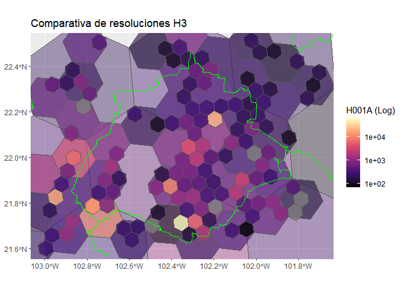

# Documentación de mi Proyecto

- [1
  simulacion_financiera](#simulacion_financiera)

# simulacion_financiera

Creación de una cartera de clientes usando PySpark para entrenamiento de
modelos economicos e implementación de data-streaming y MLOps.

