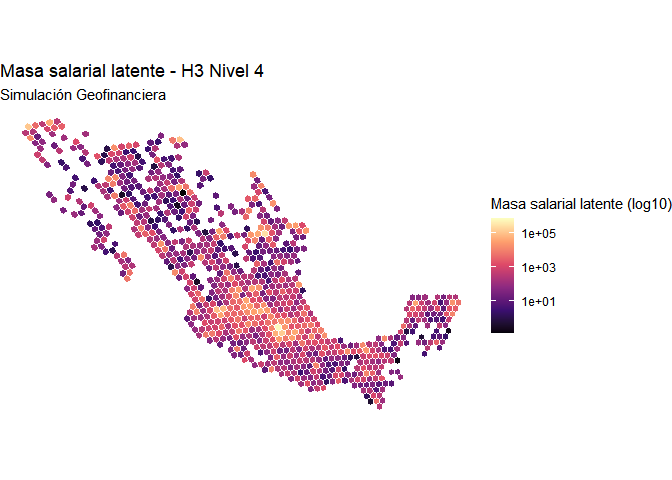
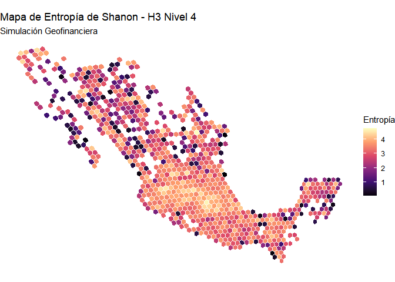
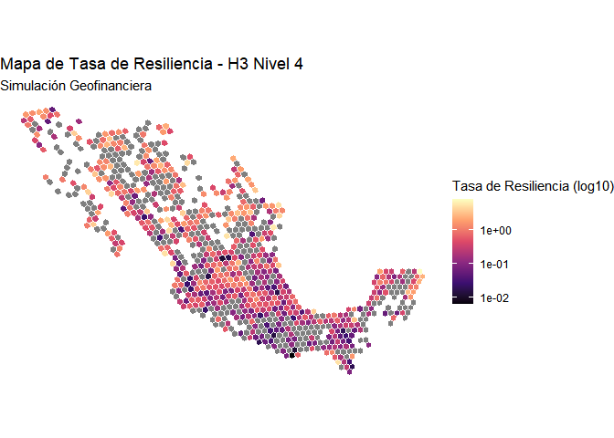

# Documentación de mi Proyecto

- [1 simulacion
  financiera](#simulacion-financiera)
- [2 Representacion de la
  información
  geo-referenciada.](#representacion-de-la-información-geo-referenciada)
  - [2.1 Entropía de
    Shanon](#entropía-de-shanon)
  - [2.2 Entropía de
    Shanon](#entropía-de-shanon-1)
  - [2.3 Tasa de
    Resiliencia](#tasa-de-resiliencia)

# simulacion financiera

Creación de una cartera de clientes usando PySpark para entrenamiento de
modelos economicos e implementación de data-streaming y MLOps.

# Representacion de la información geo-referenciada.

A continuación presentamos la información agregada de distintos indices
económicos en México, Estos coeficientes nos permitirán darle realismo
nuestro producto, diferenciándolo de un producto puramente informático.

Esas variables nos permitirán perfilar clientes y productos de cualquier
tipo para simular de forma “real” una base de datos con diferentes
operaciones, transacciones y registros de interés educativo.

## Entropía de Shanon

Valores cercanos a 0 indican monompolio sectorial (segun codigos SCIAN).

## Entropía de Shanon

Valores cercanos a 0 indican monompolio sectorial (segun codigos SCIAN).

## Tasa de Resiliencia

Valores Menores a 1 indican fragilidad crisis.

