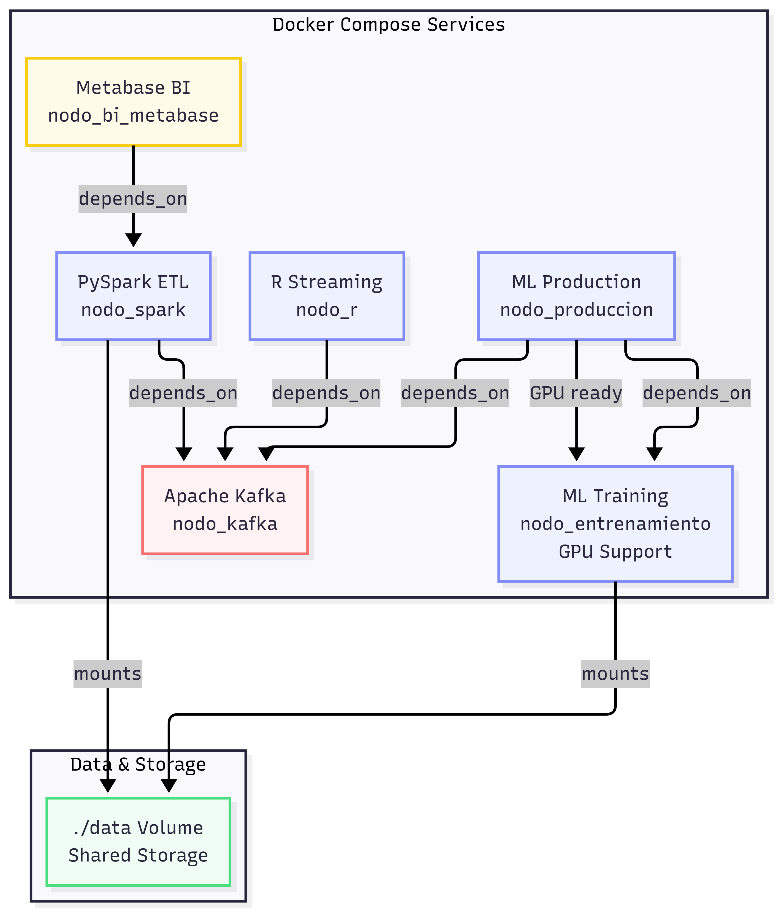

# Documentación de mi Proyecto

- [1 Simulacion
  financiera](#simulacion-financiera)
- [2 Representacion de la
  información
  geo-referenciada.](#representacion-de-la-información-geo-referenciada)
  - [2.1 Masa salarial
    latente](#masa-salarial-latente)
  - [2.2 Entropía de
    Shanon](#entropía-de-shanon)
  - [2.3 Tasa de
    Resiliencia](#tasa-de-resiliencia)

# Simulacion financiera

El objetivo de este GitHub es mostrar el uso de diferentes herramientas
computacionales en la creación de una cartera de clientes. Para lograr
esto usaremos diferentes herramientas como: - Docker para generar
contenedores con las herramientas y configuraciones necesarias. - R para
la generación de millones de registros de datos sinteticos. - PySpark y
Delta-Lake para las operaciones ETL y almacenamiento de los millones de
registros. - PyTorch, SciPy para entrenar modelos de ML y DL. - Python
para poner el modelo en producción. - Kafka para orquestar el flujo de
datos entre contenedores. El siguiente diagrama ejemplifica nuestra
configuración generada con apoyo de herramientas de IA

# Representacion de la información geo-referenciada.

A continuación presentamos la información agregada de distintos indices
económicos en México, Estos coeficientes nos permitirán darle realismo
nuestro producto, diferenciándolo de un producto puramente informático.

Esas variables nos permitirán perfilar clientes y productos de cualquier
tipo para simular de forma “real” una base de datos con diferentes
operaciones, transacciones y registros de interés educativo.

## Masa salarial latente

Valores cercanos a 0 indican monopolio sectorial (según códigos SCIAN).

## Entropía de Shanon

Valores cercanos a 0 indican monopolio sectorial (segun codigos SCIAN).

## Tasa de Resiliencia

Valores Menores a 1 indican fragilidad crisis.

